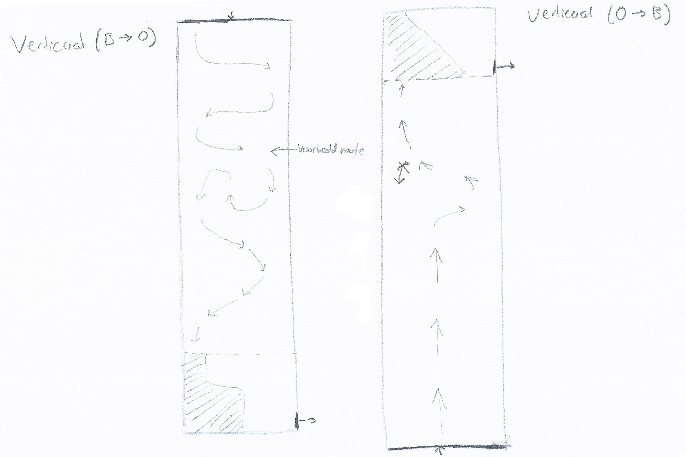
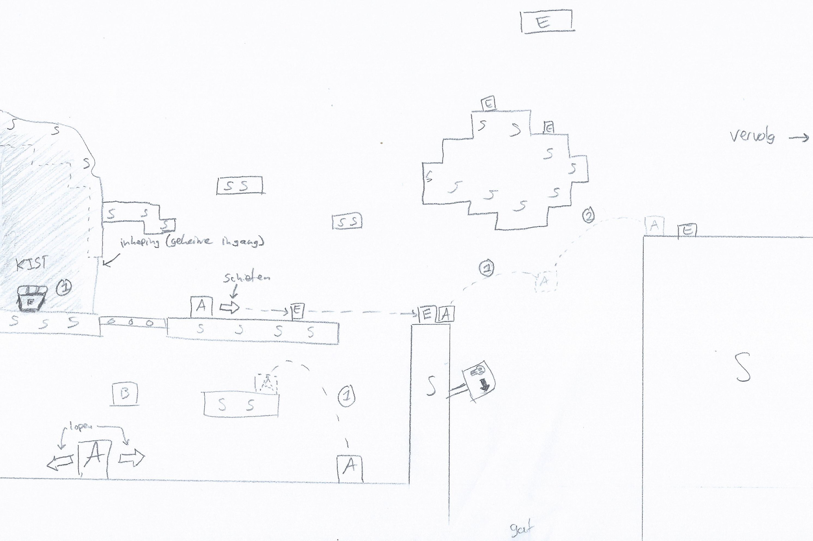

# Concept (Loek)

## General gameplay

- Platformer (similar platformer mechanics to Cuphead)
- Focus on gameplay instead of story
- Medium length levels
- Horizontally (left to right), or vertically (both directions) scrolling
  levels
- Levels get progressively more difficult (like Hades)
- Each level has a miniboss at the end
- Levels are separated by a checkpoint room
- Checkpoints don't have respawn points, but are like saferooms with a shop for
  buying upgrades (like in Hades)
- The player automatically shoots bullets as they walk
- The player's score is determined by the distance travelled + bonus points for
  various actions like defeating enemies

## Player character & abilities

- Small guy with a hood and Fall guys eyes
- Actions
  - Jump (primary action button)
  - Dash/attack (secondary action button) (upgradable -> [shop][shop])
  - Movement (D-pad)
  - Shooting (D-pad) (automatic rapid fire when holding direction)
- Temporarily invulnerable when taking damage (with flashing animation like in
  Super Mario Bros.)
- 5 HP (by default) (upgradable -> [shop][shop])

## Level design

- Hatched zones in the following sketches indicate movement zones for the
  player during a mini boss
- Outside the movement zone, the player should take damage, but the player
  should realize this intuitively
- During the miniboss, the camera is locked past the dashed line so the player
  can't escape by running away
- The camera follows the player

### Level flow

- Horizontal level always flows from left to right
- Level design in which the player has to "walk back" from right to left is
  discouraged

- Vertical levels can either flow from top to bottom, or bottom to top
- Small sections of backtracking are allowed in the top to bottom vertical flow

[shop]: #checkpoint-room-shop
### Checkpoint room (shop)

- Transition room between levels
- Visible exit point is determined by the following level type
  - Door on right side for horizontal level
  - Nuclear bunker style hatch for vertical top-bottom level
  - Ladder into black hole for vertical bottom-top level
- Game starting screen is also a checkpoint room, but without a shop
- Checkpoints don't act as reset points
- Available upgrades
  - HP boost
  - Temporary status effects
    - Jump boost
    - Speed boost
  - Different kinds of dashes (with tradeoffs)
    - Regular dash (furthest distace, no special effects)
    - Super punch (deals damage during dash, less distance)
    - Smoke bomb (temporarily invulnerable and invisible, less distance)
- Upgrades are purchased/unlocked only once per game
- Switching to other dashes is only allowed in checkpoints

### Regular level

- A: player
- B: breakable
- S: solid ground
- E: enemy
- 1: primary action
- 2: secondary action

## Enemy types

The enemies aren't named in-game, so these names are either working names or
internal names. All enemies deal 1 HP damage per hit.

### Menneke

- Runs around and jumps on platforms vaguely in the player's direction
- Slightly slower than the player
- 1 HP
- Passive (damage on contact, but doesn't actively 'hunt' the player)
- Low score bonus

### Ventje

- Runs at the player, but can't jump very high
- Slightly slower than the player
- Passive
- 2 HP
- Divides into smaller copies when defeated (like slimes from Minecraft)
- Medium-low score bonus

### Terror uil

- Roams around the top of the screen
- Sometimes attacks player
- 1 HP
- Medium-high score bonus
- Was on NOS Jeugdjournaal once

